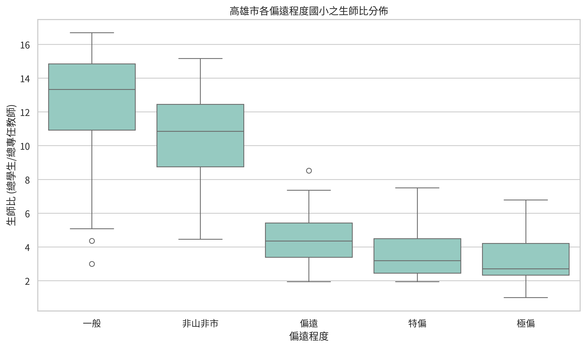
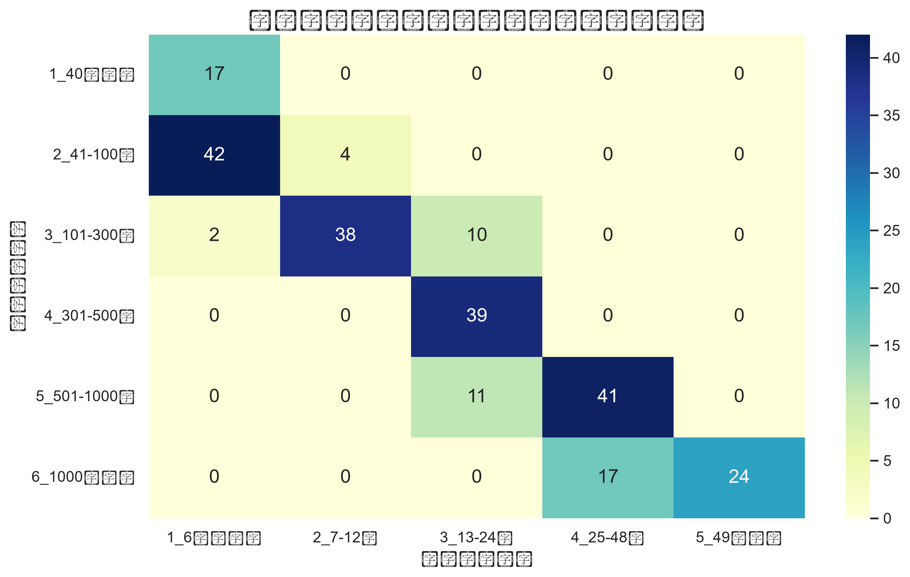
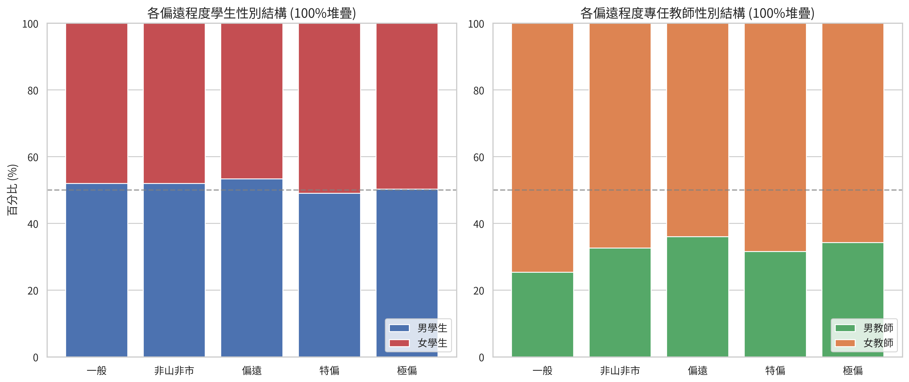
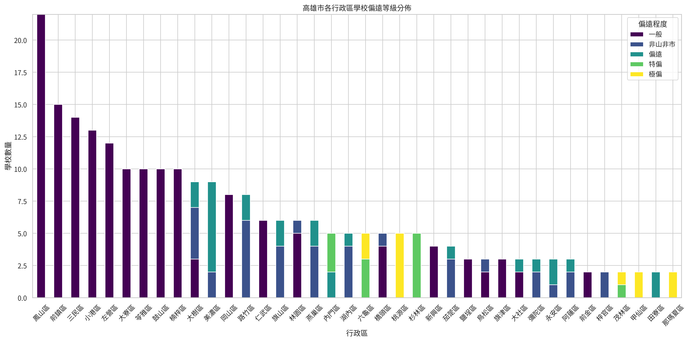

# 高雄市 114 學年度國小教育資料分析

本專案以高雄市國小學校資料為基礎，整合學校規模、班級數、偏遠程度、行政區與性別結構等變數，進行描述統計、區域比較、回歸分析與圖表輸出。

## 專案目標

- 掌握高雄市各行政區國小的學生與教師分布
- 分析學校規模與班級規模的關聯
- 比較偏遠程度與生師比之間的差異
- 產出正式報告與互動式視覺化成果

## 資料來源

資料位於 `edubigdata_HW/` 目錄：

- `高雄市114學名錄_政府公開資料庫.csv`
- `高雄市114學校別_政府公開資料庫(移除新威).csv`

## 主要分析內容

- 行政區學生數與學校數分布
- 不同規模學校的班級與學生數比較
- 偏遠程度分布與生師比分析
- 單因子與多因子回歸模型
- 性別結構與教師配置觀察

## 執行方式

### 1) 建立 Python 環境

```bash
python -m venv .venv
.venv\Scripts\activate
pip install -r requirements.txt
```

### 2) 執行主程式

```bash
python educode.py
```

主流程會自動：

- 讀取 CSV 資料
- 整理分析資料表
- 計算摘要統計
- 輸出文字報告與 CSV
- 產生 PNG / HTML 圖表

## 輸出結果

執行後，結果會輸出到 `output/` 資料夾，包含：

- `高雄市114國小_EDA摘要.txt`
- `高雄市114國小_正式報告.md`
- `高雄市114國小_區域比較.csv`
- `高雄市114國小_回歸分析摘要.txt`
- 各種統計圖與互動式圖表

## 圖表範例

- 生師比分布



- 學生人數 vs 班級規模



- 學生與教師性別結構



- 行政區偏遠等級分佈



## 重要發現：少子化下最容易面臨困境的學校規模

若將「班級數 6 班（含）以下」視為學校構造上的硬底線，則這類學校通常已經接近減班上限，若再繼續減少，更多時候會不是單純的「班級縮減與教師超額」，而是走向分校、整併或廢校的結構性調整。因此，真正最容易在少子化衝擊下出現「班級數減少、教師超額」困境的，通常是剛好位於此門檻之上的中小型學校，尤其是以下類型：

- 學生人數約 51–100 人的學校
- 班級數約 7–12 班的學校
- 偏遠與極偏地區的中小型學校

這類學校常見特徵是：

- 學生數已開始明顯下降，但尚未達到 6 班以下的最小運作門檻
- 班級數開始被迫縮減，導致單一班級的學生人數與教學負擔增大
- 教師編制難以同步裁減，因為仍需維持最低教學與行政運作
- 隨著班級數下降，學校容易出現教師超額、教學班規模失衡與資源配置不經濟
- 若再往下走到 6 班以下，則通常不再是單純的減班問題，而是整體學校規模重整的必要選項

換言之，在少子化衝擊下，真正的高風險區域並不是最小型學校本身，而是「介於小型與極小型之間、尚未到達 6 班底線但已開始走下坡的學校」。這些學校最容易在班級縮減後，形成教師超額與經營壓力同時出現的困境。

## 相關檔案

- `educode.py`：主程式
- `gemini_code.py`：補充或歷史版本
- `gemini-code-1786348741522.ipynb`：互動式分析筆記本
- `requirements.txt`：Python 套件依賴

## 備註

本專案已可在本機直接運行，並產出可供報告使用的摘要與分析結果。若要擴充分析方向，可進一步加入：

- 教育資源均衡度評估
- 區域人口與學校數量相關性分析
- 校務經營指標比較
- 時間序列趨勢分析